# 🧠 Cybersecurity Knowledge Base — Enterprise Domain Architecture

**Enterprise Cognitive Security Operating System (CSOS)**

**Version:** 1.0 — Enterprise Cognitive Security Architecture
**Author:** Sean Wong
**Date:** January 2026

---

# 📖 Executive Overview

This repository defines a **production-grade cybersecurity knowledge architecture**, engineered as a **living cognitive security operating system**, not static documentation.

It represents a **converged platform** for:

> **Security architecture, threat intelligence, detection engineering, adversary simulation, SOC operations, governance, and executive decision support.**

Rather than treating security as isolated disciplines, this system models cybersecurity as a **coherent, end-to-end engineered system** spanning:

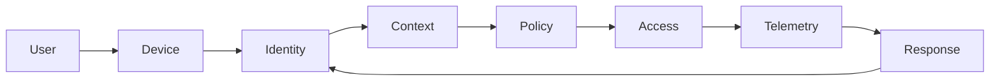

This closed-loop design ensures **continuous verification, adaptation, and resilience**.

---

# 🎯 Strategic Vision

> **Build a Cybersecurity Cognitive Operating System (CSOS)**
> — capable of reasoning holistically across **architecture, identity, risk, adversaries, controls, telemetry, response, and governance.**

### Security as an Engineered System

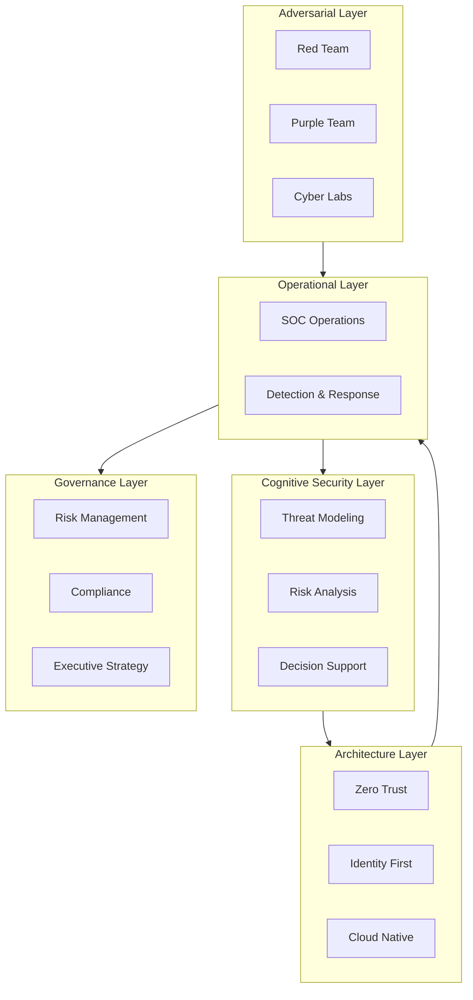

---

# 🌍 Standards & Framework Alignment

This system operationalizes global standards into **real engineering artifacts, detection logic, and attack simulations**:

* **NIST SP 800-53 / 61 / 92 / 207 (Zero Trust)**
* **ISO 27001 / 27002**
* **CIS Controls v8**
* **OWASP Top 10 / ASVS / MASVS**
* **MITRE ATT&CK & D3FEND**
* **Cloud Security Alliance CCM**

---

# 🏛 Enterprise Architecture Philosophy

## Identity-First Security Architecture

Identity becomes the **primary control plane**.

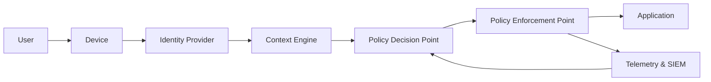

### Core Principles

* Continuous authentication
* Context-aware authorization
* Real-time policy enforcement
* Telemetry-driven access decisions

---

## Cognitive Zero Trust Architecture

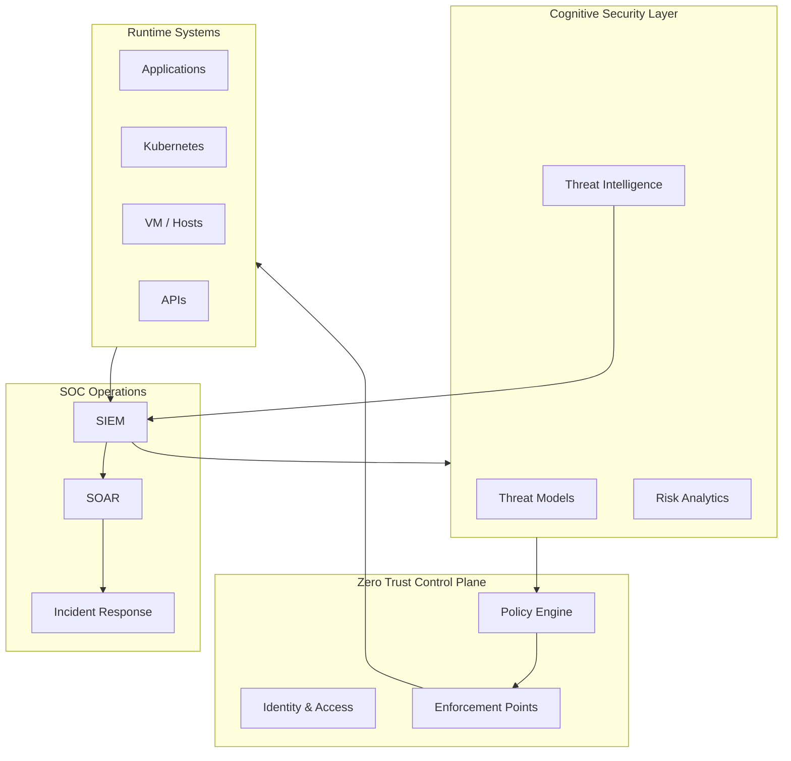

---

# 🗂 Repository Architecture

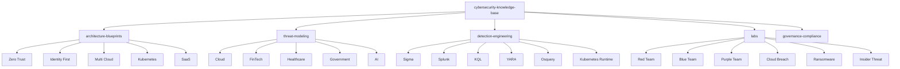

---

# 🏛 Architecture Blueprints

## Enterprise Zero Trust Reference Architecture

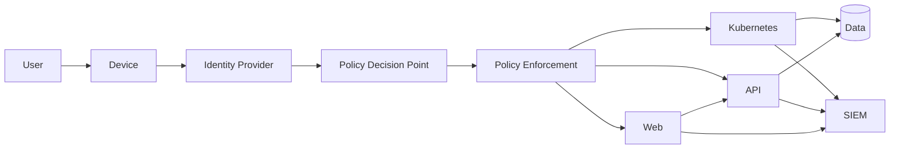

### Security Domains

* Identity & Access Control
* Microsegmentation
* Continuous Authorization
* Runtime Threat Detection
* Telemetry & SOC Integration

---

# 🛡 Threat Modeling Framework

## Threat Modeling Pipeline

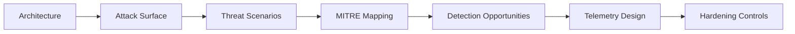

## Example: Cloud Threat Model

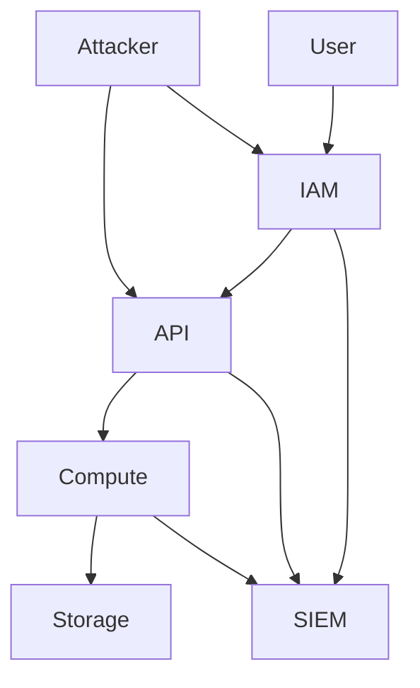

---

# 🎯 Detection Engineering Architecture

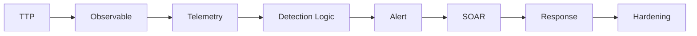

---

# 🧪 Enterprise Cyber Labs

## Cyber Range Execution Flow

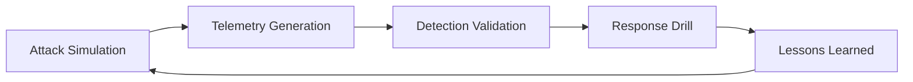

---

# 🔄 Continuous Security Feedback Loop

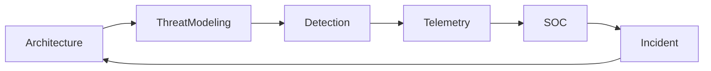

---

# 📈 Enterprise Value Proposition

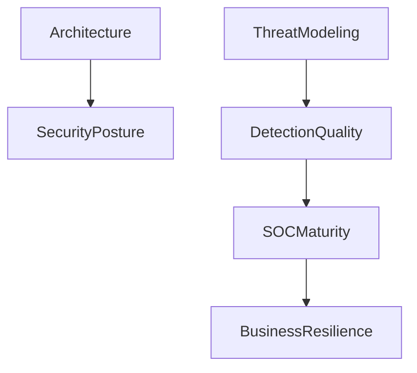

---

# 🧭 Usage Playbooks

## Security Architect Path

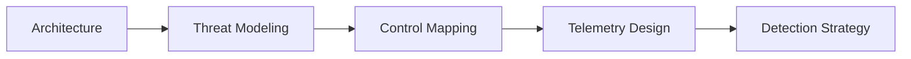

## SOC Engineer Path

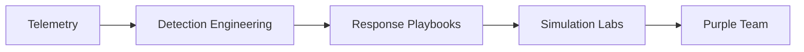

## Executive / CISO Path

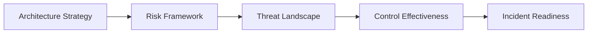

---

# 🚀 Evolution Roadmap

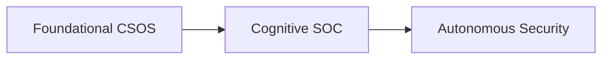

### Phase 2 — Cognitive SOC Platform

* AI-assisted detection tuning
* Adaptive risk scoring
* Automated threat modeling

### Phase 3 — Autonomous Security Engineering

* Self-healing architecture
* AI-driven response
* Continuous control validation

---

# ⚡ Closing Statement

> This repository is not documentation.
> It is a **Cybersecurity Cognitive Operating System** — a **living security brain**.

It enables:

* Architects to design secure systems
* Engineers to build resilient platforms
* SOC teams to detect and respond
* Executives to reason strategically

---

**This is a production-grade cybersecurity engineering doctrine — not a theoretical framework.**
