# 🧠 Cybersecurity Knowledge Base — Enterprise Domain Architecture

**Enterprise Cognitive Security Operating System (CSOS)**

**Version:** 1.0 — Enterprise Cognitive Security Architecture
**Author:** Sean Wong
**Date:** January 2026

---

# 📖 Executive Overview

This repository defines a **production-grade cybersecurity knowledge architecture**, engineered as a **living cognitive security operating system (CSOS)**. It is not documentation. It is **an operational security brain** — a continuously evolving system capable of reasoning about **architecture, identity, threats, telemetry, controls, and response** in a unified manner.

Unlike traditional security repositories that fragment security into compliance checklists, tooling documentation, and operational runbooks, this platform treats cybersecurity as a **coherent, engineered system** — one that behaves like a **distributed nervous system for the enterprise**.

It represents a **converged platform** for:

> **Security architecture · threat intelligence · detection engineering · adversary simulation · SOC operations · governance · executive decision support**

Rather than treating security as isolated disciplines, this system models cybersecurity as a **continuous closed-loop control system** spanning:

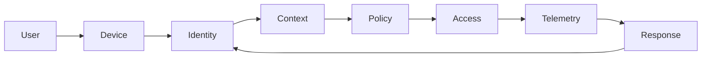

### Mental Model — Security as a Control System

Security here is modeled as a **feedback-controlled system**, not a static defense perimeter:

* **Identity + Context** establish trust dynamically
* **Policy + Enforcement** regulate access continuously
* **Telemetry + Detection** observe system health
* **Response + Hardening** adapt architecture in real time

This feedback loop ensures **continuous verification, continuous learning, and continuous adaptation**, enabling:

* Zero Trust enforcement
* Adaptive risk posture
* Resilient architecture
* SOC operational excellence

---

# 🎯 Strategic Vision

> **Build a Cybersecurity Cognitive Operating System (CSOS)** — capable of reasoning holistically across **architecture, identity, risk, adversaries, controls, telemetry, response, and governance.**

### Mental Model — Cybersecurity as a Living Organism

This system models cybersecurity as a **living organism**:

* **Nervous system:** Telemetry, logging, detection pipelines
* **Brain:** Threat modeling, risk analytics, decision engines
* **Immune system:** SOC operations, incident response, SOAR
* **Muscle memory:** Labs, simulations, adversary emulation

### Security as an Engineered System

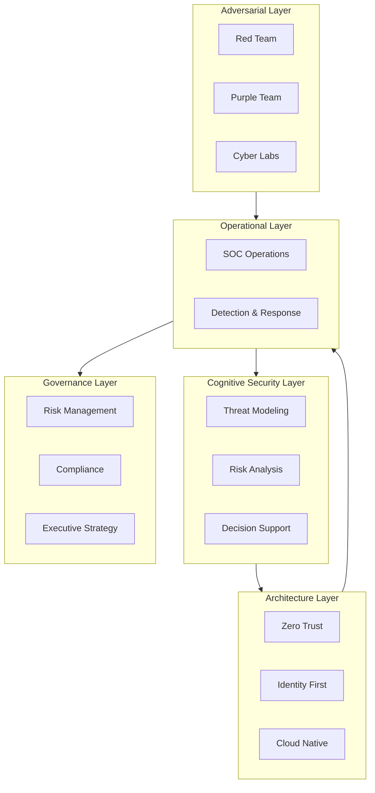

### Mental Model — Multi-Layer Security Reasoning

* **Cognitive Layer:** Strategic thinking, threat anticipation, architectural tradeoffs
* **Architecture Layer:** Secure-by-design system engineering
* **Operational Layer:** Detection, triage, response execution
* **Adversarial Layer:** Continuous red teaming and attack simulation
* **Governance Layer:** Risk quantification, regulatory mapping, executive visibility

This ensures **security is proactive, not reactive.**

---

# 🌍 Standards & Framework Alignment

This system operationalizes global standards into **real engineering artifacts, detection logic, and attack simulations** — avoiding checkbox compliance.

* **NIST SP 800-53 / 61 / 92 / 207 (Zero Trust)**
* **ISO 27001 / 27002**
* **CIS Controls v8**
* **OWASP Top 10 / ASVS / MASVS**
* **MITRE ATT&CK & D3FEND**
* **Cloud Security Alliance CCM**

### Mental Model — From Compliance to Engineering

| Traditional Security | CSOS Model                   |
| -------------------- | ---------------------------- |
| Compliance driven    | Threat & architecture driven |
| Static controls      | Adaptive enforcement         |
| Tool-centric         | System-centric               |
| Reactive SOC         | Predictive SOC               |

---

# 🏛 Enterprise Architecture Philosophy

## Identity-First Security Architecture

Identity becomes the **primary security control plane**, replacing network location as the perimeter.

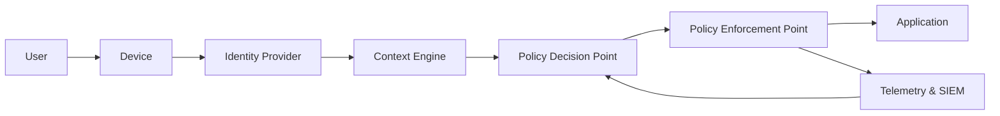

### Mental Model — Identity as the New Kernel

In classical systems:

> **The kernel enforces system security.**

In modern enterprise systems:

> **Identity is the kernel.**

Identity enforces:

* Authentication
* Authorization
* Segmentation
* Risk scoring
* Behavioral analytics

### Core Principles

* Continuous authentication
* Context-aware authorization
* Risk-adaptive policy enforcement
* Telemetry-driven trust scoring

---

## Cognitive Zero Trust Architecture

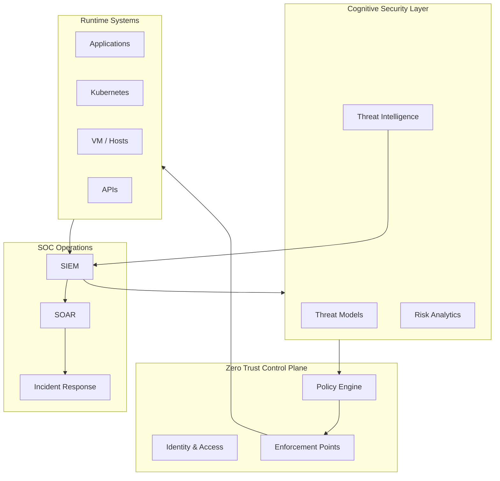

### Mental Model — Cognitive Zero Trust

Zero Trust is no longer static policy enforcement.

It becomes **adaptive trust orchestration**, where:

* Threat intelligence modifies access policy
* Telemetry dynamically tunes enforcement
* SOC findings reshape architecture

---

# 🗂 Repository Architecture

This repository is structured as a **multi-domain enterprise security engineering platform**.

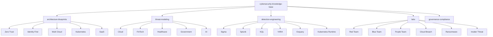

### Mental Model — Knowledge as an Operating System

Each directory represents a **functional subsystem**:

| Domain                | Role                                  |
| --------------------- | ------------------------------------- |
| Architecture          | System design and control plane       |
| Threat Modeling       | Adversarial reasoning engine          |
| Detection Engineering | Telemetry & alerting logic            |
| Labs                  | Experiential learning & muscle memory |
| Governance            | Risk & executive alignment            |

---

# 🏛 Architecture Blueprints

## Enterprise Zero Trust Reference Architecture

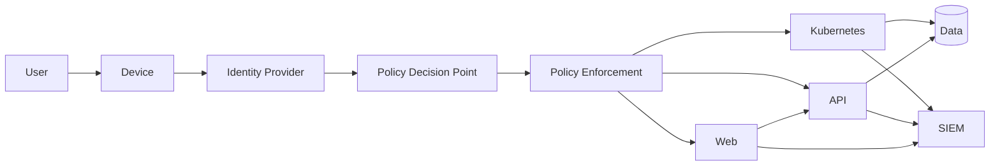

### Mental Model — Distributed Policy Enforcement

Policy enforcement happens **everywhere**:

* API gateways
* Service meshes
* Kubernetes admission controllers
* Identity proxies

This eliminates **implicit trust zones**.

---

# 🛡 Threat Modeling Framework

## Threat Modeling Pipeline

### Mental Model — Threat Modeling as Detection Design

Threat modeling is not documentation. It is **detection architecture design.**

Every threat model must produce:

* Telemetry requirements
* Detection rules
* SOC playbooks
* Control enhancements

---

# 🎯 Detection Engineering Architecture

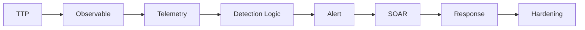

### Mental Model — Detection as Code

Detections are **software artifacts**, not static alerts:

* Version controlled
* Tested via simulations
* Continuously tuned

---

# 🧪 Enterprise Cyber Labs

## Cyber Range Execution Flow

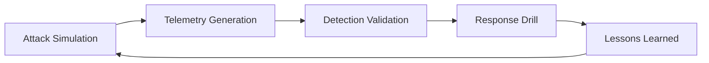

### Mental Model — Security Muscle Memory

Labs build **operational reflexes**. Engineers and analysts learn:

* How attacks actually unfold
* What good telemetry looks like
* How incidents truly feel under pressure

---

# 🔄 Continuous Security Feedback Loop

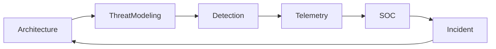

### Mental Model — Continuous Security Evolution

Security posture **evolves continuously** via feedback, not yearly audits.

---

# 📈 Enterprise Value Proposition

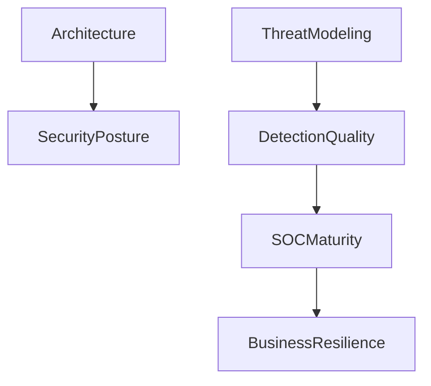

---

# 🧭 Usage Playbooks

## Security Architect Path

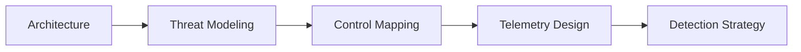

## SOC Engineer Path

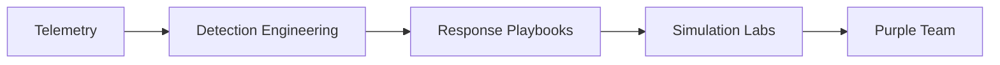

## Executive / CISO Path

---

# 🚀 Evolution Roadmap

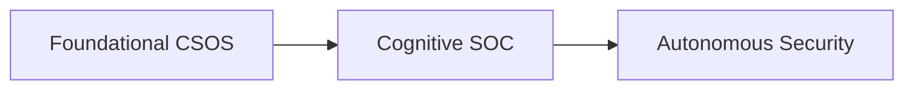

### Phase 2 — Cognitive SOC Platform

* AI-assisted detection tuning
* Adaptive risk scoring
* Automated threat modeling

### Phase 3 — Autonomous Security Engineering

* Self-healing architecture
* AI-driven response
* Continuous control validation

---

# ⚡ Closing Statement

> This repository is not documentation.
> It is a **Cybersecurity Cognitive Operating System** — a **living security brain**.

It enables:

* Architects to design secure systems
* Engineers to build resilient platforms
* SOC teams to detect and respond
* Executives to reason strategically

---

**This is a production-grade cybersecurity engineering doctrine — not a theoretical framework.**
