# 🛡 Enterprise Zero Trust Reference Architecture — Full Systems Rewrite (NIST SP 800-207 Aligned)

> **This document defines a production-grade, adversary-resilient Zero Trust Operating Architecture.**
> It integrates **identity-first security, continuous risk computation, real-time enforcement, SOC telemetry, detection engineering, and purple-team validation** into a single coherent enterprise system.

This is not a conceptual overview. This is an **executable architecture blueprint** suitable for:

* Regulated enterprises (finance, healthcare, government)
* Hyperscale cloud-native platforms
* High-assurance SaaS vendors
* Security-first product engineering teams

---

# 1. Zero Trust First Principles

Zero Trust is not a product. It is **a control system**.

Traditional perimeter security assumes a **trusted internal zone**. Zero Trust **eliminates implicit trust entirely**. Every interaction is evaluated in real time using identity, context, and continuous risk telemetry.

### Core Principles

1. **Never Trust — Always Verify**
2. **Assume Breach**
3. **Explicit Authentication & Authorization for Every Flow**
4. **Continuous Risk Recalculation**
5. **Identity Is the New Security Perimeter**

This architecture explicitly implements the NIST SP 800-207 model using **Policy Decision Points (PDP)** and **Policy Enforcement Points (PEP)**, unified into a distributed security control plane.

---

# 2. Cognitive Zero Trust Control System

Zero Trust behaves like a **real-time control system**:

| Layer              | Function             | Analogy                |
| ------------------ | -------------------- | ---------------------- |
| Signal Layer       | Collects telemetry   | Sensory nervous system |
| Policy Engine      | Computes trust       | Brain                  |
| Policy Admin       | Issues credentials   | Motor cortex           |
| Enforcement Points | Enforce decisions    | Muscles                |
| SOC                | Threat feedback loop | Immune system          |

This architecture enables **continuous access evaluation (CAE)** and **dynamic session revocation** — a critical control in a world dominated by **token theft and session hijacking**.

---

# 3. Enterprise Zero Trust Reference Architecture

### 🛰 Control Plane + Data Plane Model

```mermaid
graph TB
    subgraph External_World [Untrusted Assets]
        User((User/Subject))
        Device[Device / Endpoint]
    end

    subgraph Control_Plane [Cognitive Control Plane: PDP]
        PE[Policy Engine — Risk Computation]
        PA[Policy Administrator — Credential Issuance]
        IC[Identity & Context Providers
(IdP / HRIS / MDM / SIEM / UEBA)]
    end

    subgraph Data_Plane [Distributed Enforcement Layer: PEP]
        PEP[ZTNA Gateway / Micro-Segmentation Fabric]
    end

    subgraph Resource_Zone [Protected Workloads]
        SaaS[SaaS Apps]
        API[Internal APIs]
        DB[(Databases)]
        K8s[Kubernetes Clusters]
    end

    User & Device -->|1. Access Request| PEP
    PEP -->|2. Metadata + Context| PE
    IC -->|3. Risk Signals| PE
    PE -->|4. Policy Decision| PA
    PA -->|5. Token / Deny| PEP
    PEP -.->|6. Encrypted Micro-Tunnel| SaaS & API & DB & K8s
```

---

# 4. Signal Layer — Contextual Telemetry Engine

Authentication is no longer a binary event. It is a **multi-dimensional risk calculation**.

### Telemetry Inputs

| Signal Domain | Example Inputs                                         |
| ------------- | ------------------------------------------------------ |
| Identity      | MFA strength, role, historical behavior (UEBA)         |
| Device        | Patch state, EDR, encryption, jailbreak/root detection |
| Network       | ASN reputation, impossible travel, TOR/VPN fingerprint |
| Behavioral    | Keystroke cadence, session velocity, access anomalies  |
| Threat Intel  | IOC feeds, botnet IPs, adversary infrastructure        |

### Output

A **continuous trust score** (0–100) used to dynamically permit, restrict, or revoke access.

---

# 5. Policy Decision Point (PDP) — The Security Brain

The PDP computes **real-time authorization** based on dynamic risk signals.

### 5.1 Policy Engine — Trust Computation

Implements:

* Weighted risk scoring
* Adaptive policy logic
* Behavior-based anomaly detection
* Conditional access controls

Example Logic:

```
IF device_risk > threshold OR
   impossible_travel == true OR
   token_anomaly == true
THEN
   revoke_session()
```

### 5.2 Policy Administrator — Credential Lifecycle

* Issues short-lived tokens
* Rotates credentials
* Revokes sessions instantly via CAE
* Enforces Just-In-Time (JIT) elevation

---

# 6. Policy Enforcement Point (PEP) — Micro-Segmentation Fabric

ZTNA gateways and service mesh proxies enforce **identity-based segmentation**.

### Enforcement Capabilities

* Per-session encryption
* Per-request authorization
* L7 application segmentation
* East–West service isolation

This eliminates **lateral movement** even after compromise.

---

# 7. Trust Scoring Matrix (Operational Model)

| Asset Sensitivity | Minimum Trust | Required Signals                           |
| ----------------- | ------------- | ------------------------------------------ |
| Public Wiki       | 10            | Valid ID                                   |
| Source Code       | 80            | Managed Device + MFA + Repo Token          |
| Prod APIs         | 90            | Compliant Device + Strong MFA + CAE        |
| Prod Databases    | 95            | All above + JIT Approval + SOC Attestation |

---

# 8. Detection Engineering — Identity-Centric Threat Model

> In 2026, attackers no longer crack passwords — **they steal sessions**.

Detection focuses on:

* Token theft
* Session hijacking
* Device impersonation
* Behavioral drift

---

## 8.1 Impossible Travel Detection — KQL

```kql
let SpeedThreshold = 500;
SigninLogs
| where ResultType == 0
| extend Location = parse_json(LocationDetails)
| project TimeGenerated, UserPrincipalName, IPAddress, 
           Latitude = toreal(Location.geoCoordinates.latitude), 
           Longitude = toreal(Location.geoCoordinates.longitude)
| serialize
| extend PrevLatitude = prev(Latitude), PrevLongitude = prev(Longitude), 
         PrevTime = prev(TimeGenerated), PrevUPN = prev(UserPrincipalName)
| where UserPrincipalName == PrevUPN
| extend Distance = geo_distance_2points(Longitude, Latitude, PrevLongitude, PrevLatitude) / 1000
| extend TimeDiff = datetime_diff('hour', TimeGenerated, PrevTime)
| extend Speed = Distance / TimeDiff
| where Speed > SpeedThreshold and TimeDiff > 0
```

---

## 8.2 Session Hijacking Detection — Splunk

```spl
index=azure_ad_logs sourcetype="aad:signin"
| sort 0 _time
| streamstats window=2 current=f last(ip_address) as prev_ip, last(user_agent) as prev_ua by correlation_id
| where (ip_address != prev_ip OR user_agent != prev_ua) AND correlation_id != ""
| table _time, user_principal_name, correlation_id, prev_ip, ip_address, prev_ua, user_agent
```

---

# 9. Hardening Checklist — Identity-First Perimeter

| Control           | Purpose                       |
| ----------------- | ----------------------------- |
| FIDO2 / Passkeys  | Eliminates MFA fatigue & AiTM |
| Token Binding     | Prevents session export       |
| CAE               | Real-time revocation          |
| Device Compliance | Prevents unmanaged access     |

---

# 10. Blue Team Lab — Operation Sticky Token

## Objective

Detect, analyze, and remediate **session hijacking via AiTM token theft**.

---

## Scenario

* Victim: Senior DevOps Engineer
* Attack: AiTM phishing proxy captures session cookie
* Outcome: Attacker bypasses MFA

---

## Investigation Flow

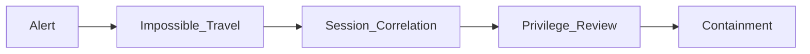

---

# 11. Red Team Lab — Phantom Proxy (AiTM)

## Objective

Simulate real-world **token theft via transparent authentication proxy**.

---

## Attack Chain

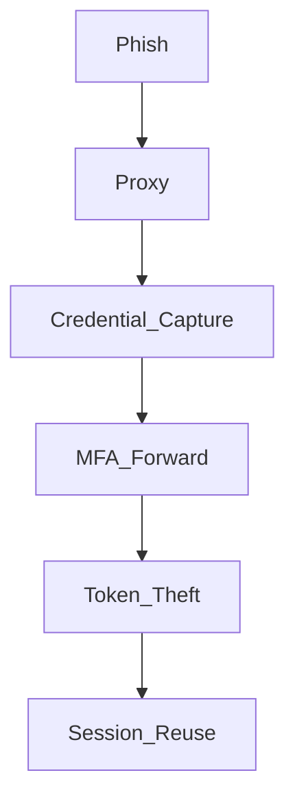

---

# 12. Kubernetes Zero Trust Architecture

> We assume the cluster is compromised. Identity becomes the only security boundary.

---

## Service Mesh Micro-Segmentation

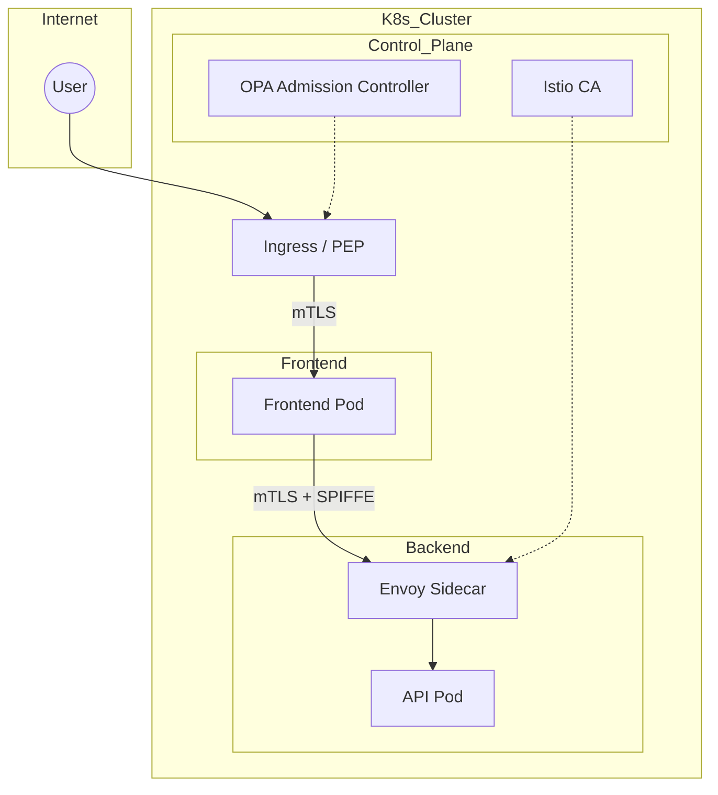

---

## 4 Layers of Kubernetes Zero Trust

| Layer    | Controls           |
| -------- | ------------------ |
| Identity | SPIFFE, SVIDs      |
| Network  | mTLS, Default Deny |
| Policy   | OPA / Kyverno      |
| Secrets  | Vault CSI Driver   |

---

# 13. Strategic Security Posture

This architecture enables:

* Token-theft resistance
* Lateral-movement elimination
* Runtime adaptive security
* SOC-driven access control
* Real-world adversary simulation

This is **Zero Trust as an Operating System**, not a security product.

---

# 14. Repository Integration Map

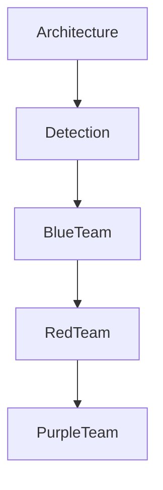

---

# 15. Strategic Next Step

## Threat Modeling for Kubernetes & Cloud Control Planes

Focus Areas:

* Container escape
* API server exploitation
* Service account abuse
* Supply chain compromise

---

**This document now represents a full enterprise-grade Zero Trust operating blueprint.**

---

# ☁ Cloud Control Plane Zero Trust Architecture

> **Objective:** Secure the most powerful attack surface in modern enterprises — the **cloud control plane** — by enforcing **identity-driven Zero Trust**, continuous verification, and SOC-integrated detection.

In modern cloud environments, **compromising the control plane equals total platform takeover**. Attackers no longer need to exploit servers — they exploit **IAM**, **metadata services**, **token brokers**, and **CI/CD identities**.

This architecture establishes a **Cognitive Cloud Control Plane Security Model**.

---

## 🧠 Mental Model: Cloud as a Distributed Identity Operating System

Traditional thinking:

> Cloud = Compute + Network + Storage

Modern reality:

> Cloud = **Identity + API + Policy + Token + Telemetry**

Every cloud action is:

```
Identity → Token → API → Resource
```

If an attacker controls **identity or token issuance**, they own the cloud.

---

## 🏗 Cloud Zero Trust Reference Architecture

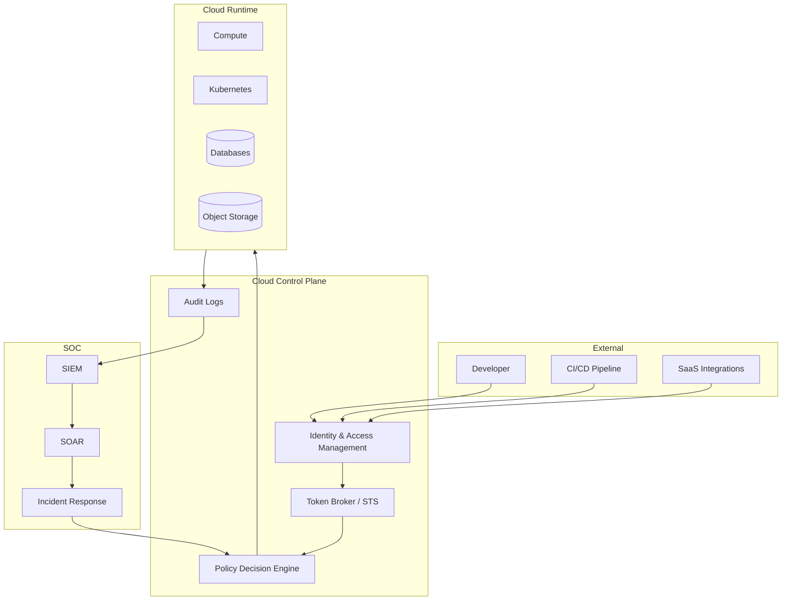

---

## 🎯 Core Principles

### 1. Identity Is the Only Perimeter

* No implicit trust based on network location
* No long-lived credentials
* No standing privilege

### 2. Tokens Are High-Value Assets

Modern attackers steal **OAuth tokens, STS, workload identity tokens**, not passwords.

### 3. All Actions Are Policy Evaluations

Every API call becomes:

```
Request → Context → Risk → Decision → Enforcement → Telemetry
```

---

## 🧬 Cloud Attack Kill Chain

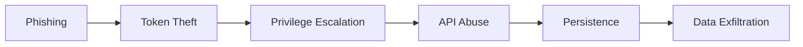

---

## 🚨 Primary Cloud Threat Classes

| Threat                    | Description                                   |
| ------------------------- | --------------------------------------------- |
| **Token Theft**           | Stealing OAuth, STS, workload identity tokens |
| **Golden SAML**           | Forging authentication assertions             |
| **CI/CD Abuse**           | Compromising pipeline identities              |
| **Metadata Exploitation** | Stealing instance credentials                 |
| **API Enumeration**       | Discovering high-privilege APIs               |

---

## 🏛 Policy Decision Model

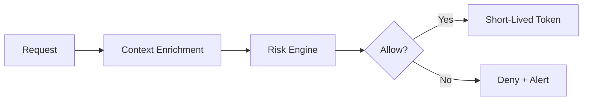

---

## 🔍 Detection Engineering — Cloud Control Plane

### Core Detection Philosophy

> **Detect misuse of identity, not infrastructure.**

---

### KQL: Azure Privilege Escalation Detection

```kql
AuditLogs
| where OperationName contains "Add member to role"
| where Result == "success"
| project TimeGenerated, InitiatedBy, TargetResources
```

---

### Splunk: AWS AssumeRole Abuse

```spl
index=cloudtrail eventName=AssumeRole
| stats count by sourceIPAddress, userIdentity.arn, requestParameters.roleArn
| where count > 5
```

---

## 🧪 Blue Team Lab — Cloud Control Plane Breach

### Scenario: Token Theft → Admin Privilege → Persistence

**Objective:** Detect and evict attacker who steals cloud workload identity.

---

### Investigation Workflow

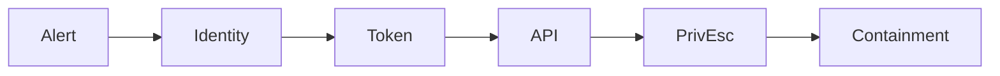

---

## 🚩 Red Team Lab — Cloud Token Hijacking

### Attack: Instance Metadata Credential Theft

```bash
curl http://169.254.169.254/latest/meta-data/iam/security-credentials/
```

---

## 🔐 Hardening Controls

| Layer     | Control                       |
| --------- | ----------------------------- |
| Identity  | Conditional Access + CAE      |
| Token     | Short-lived STS (≤15m)        |
| CI/CD     | Workload Identity Federation  |
| API       | SCP / Azure Policy Guardrails |
| Telemetry | Immutable Audit Logs          |

---

## 🧭 Repository Integration

```
architecture-blueprints/
 └── cloud_zero_trust_control_plane.md

threat-modeling/
 └── cloud_control_plane_threat_model.md

labs/
 ├── blue_team/cloud_breach.md
 └── red_team/cloud_token_attack.md
```

---

## 🧠 Final Mental Model

> **You do not secure servers.
> You secure identities.
> You do not block attacks.
> You collapse trust.
> You do not chase alerts.
> You control decision engines.**

---

---

# 🏗 CI/CD Zero Trust Architecture — Enterprise Supply Chain Security

> **Objective:** Secure the most exploited attack vector in modern breaches — the **software supply chain** — by enforcing **identity-first pipeline security, cryptographic integrity, and continuous verification** across build, test, and deployment systems.

Modern attackers no longer target servers — they target **pipelines, source code, artifacts, and automation identities**.

This architecture establishes a **Zero Trust Software Factory**.

---

# 🧠 Mental Model: CI/CD as a Privileged Identity System

Traditional view:

> CI/CD = Automation + Scripts

Modern reality:

> CI/CD = **High-Privilege Identity + Token Broker + Code Execution Engine**

Every pipeline run is effectively:

```
Identity → Token → API → Infrastructure → Production
```

If attackers compromise the pipeline, they bypass **every perimeter control simultaneously**.

---

# 🏛 CI/CD Zero Trust Reference Architecture

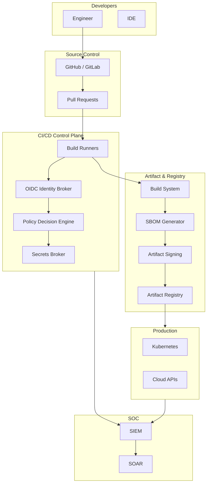

---

# 🔐 Core Zero Trust Principles for CI/CD

## 1. No Long-Lived Secrets

* Replace API keys with **OIDC Workload Identity Federation**
* All credentials are **short-lived & dynamically issued**

## 2. Cryptographic Provenance

Every artifact must be:

```
Built → Measured → Signed → Verified → Deployed
```

## 3. Policy-Driven Pipelines

Every stage is a **policy evaluation**, not a static script.

---

# 🧬 Supply Chain Attack Kill Chain

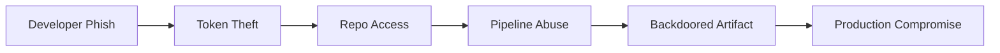

---

# 🚨 Primary CI/CD Threat Classes

| Threat                   | Description                        |
| ------------------------ | ---------------------------------- |
| **Token Theft**          | Stealing GitHub/GitLab OIDC tokens |
| **Pipeline Poisoning**   | Injecting malicious build steps    |
| **Artifact Backdooring** | Inserting malware into images      |
| **Dependency Confusion** | Hijacking package resolution       |
| **SBOM Tampering**       | Hiding vulnerable components       |

---

# 🏛 Policy Decision Model (CI/CD)

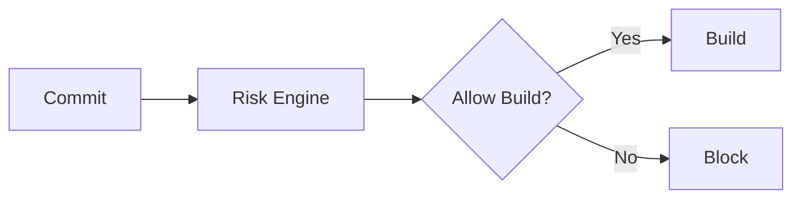

### Signals

* Commit author trust
* PR reviewer trust
* Code diff sensitivity
* Dependency changes
* Pipeline config drift

---

# 🔍 Detection Engineering — CI/CD Attacks

## Philosophy

> **Detect identity misuse and build anomalies — not malware.**

---

## Splunk: GitHub Actions OIDC Token Abuse

```spl
index=github actions_event=oidc_token_request
| stats count by actor, repository, workflow
| where count > 20
```

---

## KQL: Azure DevOps Pipeline Credential Abuse

```kql
AzureDevOpsAudit
| where OperationName contains "CreateAccessToken"
| summarize count() by Actor, IPAddress
| where count_ > 10
```

---

# 🧪 Blue Team Lab — Supply Chain Breach

### Scenario: Pipeline Poisoning → Artifact Backdoor → Production Breach

**Objective:** Detect malicious pipeline modification and prevent deployment.

---

### Investigation Workflow

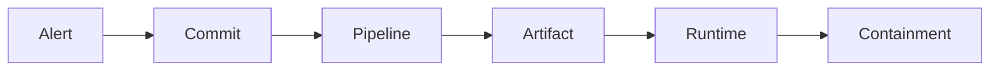

---

# 🚩 Red Team Lab — CI/CD Pipeline Takeover

### Attack: GitHub Actions Credential Hijack

```bash
# Steal workflow token
curl $ACTIONS_ID_TOKEN_REQUEST_URL
```

---

# 🔐 Hardening Controls

| Layer    | Control                           |
| -------- | --------------------------------- |
| Identity | OIDC Federation Only              |
| Pipeline | Signed Workflow Policies          |
| Artifact | Sigstore / Cosign                 |
| Registry | Immutable Tags                    |
| Deploy   | Admission Controller Verification |

---

# 📋 Supply Chain Security Checklist

| Category     | Control                     |
| ------------ | --------------------------- |
| Identity     | Short-lived pipeline tokens |
| Build        | Hermetic builds             |
| Dependencies | Lockfiles + Provenance      |
| Artifacts    | Mandatory signing           |
| Deploy       | Signature verification      |

---

# 🧭 Repository Integration

```
architecture-blueprints/
 └── cicd_zero_trust_architecture.md

threat-modeling/
 └── supply_chain_threat_model.md

detection-engineering/
 ├── kql_queries/cicd_threats.md
 └── splunk_queries/cicd_threats.md

labs/
 ├── red_team/pipeline_takeover.md
 └── blue_team/supply_chain_breach.md
```

---

# 🧠 Final Mental Model

> **Your CI/CD system is your most powerful administrator.
> Secure it like a nuclear launch console.**

---
