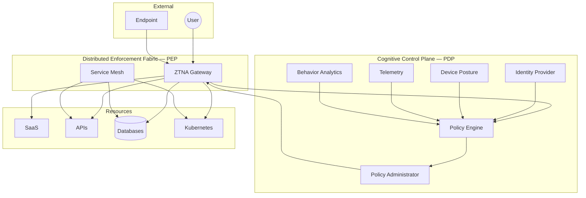
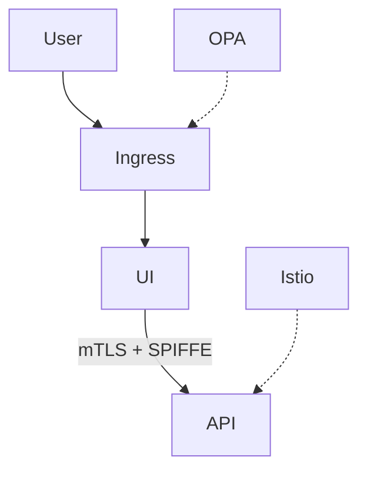
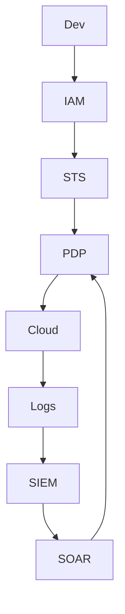
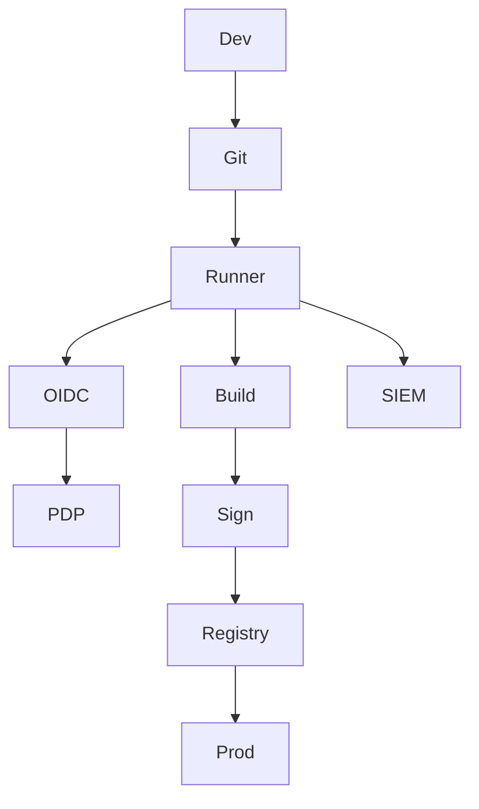
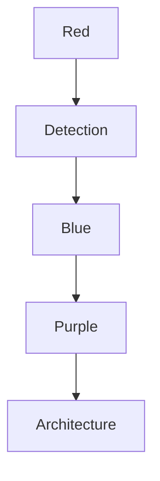

# 🛡 Enterprise Zero Trust Reference Architecture (Aligned to NIST SP 800-207)

> **This document defines a production-grade, adversary-resilient Zero Trust Operating Architecture.**
> It integrates **identity-first security, continuous risk computation, real-time enforcement, SOC telemetry, detection engineering, and purple-team validation** into a single coherent enterprise system.

This is not a conceptual overview. This is an **executable architecture blueprint** suitable for:

* Regulated enterprises (finance, healthcare, government)
* Hyperscale cloud-native platforms
* High-assurance SaaS vendors
* Security-first product engineering teams

---

# 1. Zero Trust First Principles

Zero Trust is not a product. It is **a cybernetic control system**.

Traditional perimeter security assumes a **trusted internal zone**. Zero Trust **eliminates implicit trust entirely**. Every interaction is evaluated in real time using **identity, context, telemetry, behavioral analytics, and continuous risk computation**.

### Core Principles

1. **Never Trust — Always Verify**
2. **Assume Breach**
3. **Explicit Authentication & Authorization for Every Flow**
4. **Continuous Risk Recalculation**
5. **Identity Is the Only Security Perimeter**

This architecture explicitly implements **NIST SP 800-207 Zero Trust Architecture (ZTA)** using **Policy Decision Points (PDP)** and **Policy Enforcement Points (PEP)** unified into a **distributed cognitive security control plane**.

---

# 2. Cognitive Zero Trust Control System

Zero Trust behaves as a **real-time autonomous control loop**.

| Layer              | Function                       | Analogy                |
| ------------------ | ------------------------------ | ---------------------- |
| Signal Layer       | Telemetry ingestion            | Sensory nervous system |
| Policy Engine      | Risk computation & reasoning   | Brain                  |
| Policy Admin       | Credential lifecycle control   | Motor cortex           |
| Enforcement Points | Distributed access enforcement | Muscles                |
| SOC                | Threat learning feedback       | Immune system          |

This design enables:

* **Continuous Access Evaluation (CAE)**
* **Instant session revocation**
* **Adaptive policy enforcement**

These capabilities are critical in an adversary environment dominated by **token theft, AiTM phishing, and identity compromise**.

---

# 3. Enterprise Zero Trust Reference Architecture

### 🛰 Control Plane + Data Plane Model



---

# 4. Signal Layer — Contextual Telemetry Engine

Authentication is no longer binary. It is a **continuous probabilistic trust computation**.

### Telemetry Inputs

| Domain       | Signals                                        |
| ------------ | ---------------------------------------------- |
| Identity     | MFA strength, role risk, UEBA anomalies        |
| Device       | Patch state, EDR health, encryption, jailbreak |
| Network      | ASN reputation, impossible travel, TOR, VPN    |
| Behavioral   | Session velocity, command cadence              |
| Threat Intel | IOC feeds, botnet infra                        |

### Output

A **continuous trust score (0–100)** that dynamically governs:

* Session creation
* Privilege escalation
* Step-up authentication
* Session revocation

---

# 5. Policy Decision Point (PDP)

The PDP is the **security reasoning engine**.

## 5.1 Policy Engine

* Risk-weighted evaluation
* Behavior modeling
* Adaptive trust thresholds
* Conditional policy execution

```text
IF risk_score < threshold OR
   anomaly_detected OR
   token_abuse
THEN revoke_session()
```

## 5.2 Policy Administrator

* Issues short-lived credentials
* Enforces JIT privilege
* Rotates tokens continuously
* Enforces CAE revocation

---

# 6. Policy Enforcement Point (PEP)

Distributed enforcement fabric providing:

* Identity-based microsegmentation
* Per-request authorization
* Mutual TLS
* East–West isolation

This collapses **lateral movement paths** even post-compromise.

---

# 7. Operational Trust Scoring Model

| Asset    | Trust | Required Signals          |
| -------- | ----- | ------------------------- |
| Wiki     | 10    | Identity                  |
| Git      | 80    | Device + MFA + Repo token |
| Prod API | 90    | Compliant device + CAE    |
| Prod DB  | 95    | JIT + SOC approval        |

---

# 8. Detection Engineering — Identity-Centric Security

> Modern attackers steal **tokens and sessions**, not passwords.

### Detection Focus

* Session hijacking
* Token replay
* Behavioral drift
* Identity privilege abuse

---

# 9. Kubernetes Zero Trust Architecture

> Assume cluster compromise — **identity becomes the only boundary**.



| Layer    | Controls       |
| -------- | -------------- |
| Identity | SPIFFE, SVID   |
| Network  | mTLS, deny-all |
| Policy   | OPA, Kyverno   |
| Secrets  | Vault CSI      |

---

# 10. Cloud Control Plane Zero Trust

> Control plane compromise = **total platform takeover**.



**Security Objective:** Collapse trust across **IAM, tokens, APIs, pipelines**.

---

# 11. CI/CD Zero Trust Architecture

> Pipelines are **root administrators**. Secure accordingly.



---

# 12. Red / Blue / Purple Team Integration



---

# 13. Strategic Security Outcomes

This architecture enables:

* Token theft resistance
* Identity-first threat containment
* Lateral movement elimination
* SOC-driven access control
* Continuous adversary simulation

---

# 14. Final Mental Model

> **You do not secure servers.
> You secure identities.
> You do not block attacks.
> You collapse trust.
> You do not chase alerts.
> You control decision engines.**

---

**This document represents a full enterprise-grade Zero Trust Operating System architecture.**
