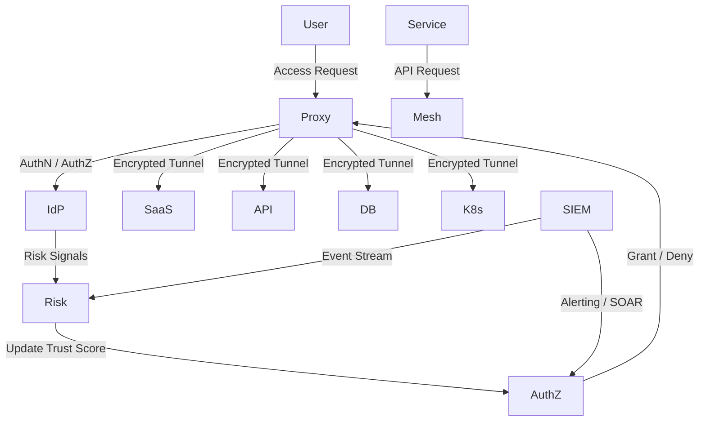
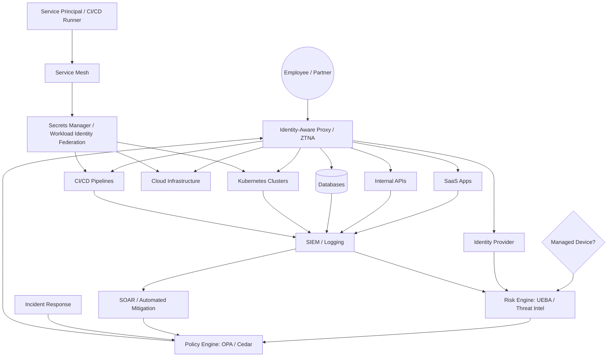

# 🏛 Identity-First Enterprise Architecture — 2026 Blueprint

> **Objective:** Transform identity from a static credential into a **dynamic, context-aware control plane** governing access for humans, devices, and non-human identities across SaaS, cloud, and on-prem workloads.
> Designed for **enterprise-scale**, **cloud-native platforms**, and **high-assurance environments**.

---

## 1️⃣ Identity as a Dynamic Control Plane

Modern identity is **continuous, adaptive, and risk-aware**. Every access decision is a function of:

* **Human Identities:** Employees, contractors, partners
* **Non-Human Identities (NHI):** Service principals, bots, CI/CD runners
* **Contextual Signals:** Device posture, location, network trust, session velocity
* **Continuous Risk Assessment:** UEBA, threat intelligence, behavioral scoring

> **Access Evaluation Formula:**
> `Identity + Context + Risk → Policy Decision → Enforcement`

Identity is now **real-time and adaptive**, not just a static database entry.

---

## 2️⃣ Identity-First Architecture Blueprint

```mermaid
graph TB
    %% Subjects
    subgraph Subjects [Human & Non-Human Identities]
        User((Employee / Partner))
        Device{Managed Device?}
        Service[Service Principal / Bot / CI/CD Runner]
    end

    %% Control Plane
    subgraph Control_Plane [Cognitive Identity Control Plane (PDP)]
        IdP[Identity Provider: Entra ID / Okta / PingID]
        Risk[Risk Engine: UEBA / Threat Intel / SIEM]
        AuthZ[Policy Engine: OPA / Cedar / Rego]
    end

    %% Enforcement Layer
    subgraph Enforcement_Layer [PEP: Enforcement Layer]
        Proxy[Identity-Aware Proxy / ZTNA]
        Mesh[Service Mesh / Envoy Sidecar]
        Secrets[Secrets Manager / Workload Identity Federation]
    end

    %% Protected Resources
    subgraph Resources [Protected Assets]
        SaaS[SaaS Apps]
        API[Internal APIs]
        Cloud[Cloud Infrastructure]
        DB[(Databases)]
        K8s[Kubernetes Clusters]
        CI[CI/CD Pipelines]
    end

    %% Flows
    User -->|1. Access Request| Proxy
    Device -->|2. Device Signal| Risk
    Service -->|3. API/Token Request| Mesh
    Proxy -->|4. Authenticate & Context| IdP
    IdP <-->|5. Aggregate Risk Signals| Risk
    IdP -->|6. Policy Evaluation| AuthZ
    AuthZ -->|7. Issue Short-Lived / JIT Token| Proxy
    Proxy -->|8. Secure Tunnel / Enforcement| SaaS & API & DB & K8s
    Mesh -->|9. Token Exchange| Secrets
    Secrets -->|10. Access Authorization| Cloud & K8s & CI
```

---

## 3️⃣ Core Enhancements

### 3.1 Adaptive Risk Signaling

* Access decisions are based on **device compliance, location, network trust, session velocity**
* Dynamic **Authentication Assurance Level (AAL)**

| Risk Level | Conditions                      | Enforcement                    |
| ---------- | ------------------------------- | ------------------------------ |
| Low        | Managed device, trusted network | Passwordless / Biometric       |
| Medium     | New location, BYOD              | FIDO2 / Phishing-resistant MFA |
| High       | Impossible travel, leaked creds | Account lock / IT intervention |

### 3.2 Non-Human Identity (NHI)

* 80–90% of enterprise access is non-human
* Use **Workload Identity Federation** + Secrets Managers (Vault, AWS, GCP)
* Example: Kubernetes Pod → OIDC Token → Cloud API

### 3.3 Identity-Aware Proxy (IAP)

* Replaces traditional VPNs
* Applications invisible until identity verified
* Supports JIT tokens, encrypted tunnels, continuous telemetry

### 3.4 Policy-as-Code (PaC)

* Versioned, testable, dynamic access policies via **OPA / Cedar / Rego**

```rego
allow {
  input.identity.groups[_] == "SRE_TEAM"
  input.device.is_compliant
  input.request.method == "READ_ONLY"
  input.jit_ticket
}
```

### 3.5 Continuous Telemetry & SOC Feedback

* Aggregates identity, device, network, behavioral, and threat signals
* Enables **Continuous Adaptive Authentication (CAE)**

---

## 4️⃣ Maturity Model

| Level       | Strategy           | Authentication           | Access Type                    |
| ----------- | ------------------ | ------------------------ | ------------------------------ |
| Traditional | Network-First      | Password + SMS           | Broad (VPN)                    |
| Advanced    | Identity-First     | Passwordless / FIDO2     | Segmented (VLANs)              |
| Zero Trust  | Identity + Context | Continuous Adaptive Auth | Granular (Resource-level, JIT) |

---

## 5️⃣ SOC-Integrated Risk Flows



---

## 6️⃣ Benefits

1. **Dynamic Control Plane**: Real-time risk-aware evaluation
2. **Non-Human Identity Management**: Service principals, CI/CD runners, bots
3. **Policy-as-Code**: Versioned and testable policies
4. **Zero Trust Enforcement**: IAP + Service Mesh micro-segmentation
5. **SOC Integration**: Telemetry feeds automated mitigations

---

## 7️⃣ 2026-Ready Features

* Unified evaluation for humans, devices, and NHIs
* Short-lived, Just-in-Time (JIT) tokens reduce lateral attack surface
* Granular resource protection (SaaS, APIs, DB, Kubernetes, CI/CD)
* Closed-loop telemetry: **SIEM → Risk Engine → PDP → PEP → Resources**
* Dynamic SOC dashboards with live risk propagation

---

# 🖥 Interactive Identity-First SOC Dashboard — Prototype

### Core Flow



### Dashboard Features

* **Dynamic Risk Scores**: Green → Yellow → Red
* **Top 5 High-Risk Panel**: Dynamic list of risky identities & assets
* **Drag & Drop Layout**
* **Tooltips with metadata**
* **Telemetry integration-ready** (Kafka / WebSocket / SIEM)

---

## 8️⃣ Simulation & SOC Alerts

* **Edge pulse animation** for active flows
* **Incident injection**: Impossible Travel, Credential Leak, Brute Force, Token Misuse
* **Risk propagation** along connected nodes
* **SOC recommendations** per incident
* **Top high-risk assets update dynamically**

---

### ✅ Next-Level Enhancements

1. Edge thickness proportional to risk → critical paths visible
2. Node size = resource criticality → prioritize mitigation
3. Animated risk flows → visualize active incidents
4. Real-time telemetry feed → live SOC simulation
5. Full SOC panel → alerts, JIT status, policy violations

