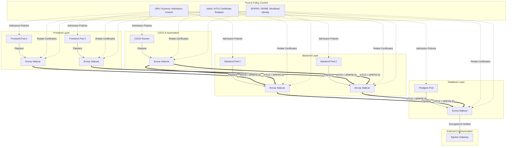

# 🛡 Kubernetes Zero Trust Architecture — 2026 Enterprise Blueprint

> **Goal:** Move from network-centric security to **identity-driven, cryptographically enforced Zero Trust** across Kubernetes workloads, protecting **Pod-to-Pod, Pod-to-Service, and Pod-to-External** communications at Layer 7, even in hostile networks.

---

## 1️⃣ Core Principles

1. **Identity over Network**

   * IPs, subnets, and namespaces are **untrustworthy**.
   * Each workload receives a **cryptographically verifiable SPIFFE identity (SVID)**.
   * Traffic is **per-request authenticated**, preventing lateral movement even if the network is compromised.

2. **Mutual TLS Everywhere**

   * All Pod-to-Pod, service-to-service, and egress traffic uses **mTLS with mutual authentication**.
   * Certificates are **short-lived and automatically rotated** by the service mesh control plane.

3. **Policy-as-Code**

   * Enforce **pre-deployment validation** of workloads:

     * `privileged: false` containers
     * No unauthorized `hostPath` mounts
     * Only approved container registries allowed

4. **Least Privilege & JIT Access**

   * Augment RBAC with **Just-in-Time (JIT) access** for admins and CI/CD pipelines.
   * High-privilege operations are **time-bound and fully audited**.

---

## 2️⃣ Kubernetes Zero Trust Architecture

---

## 3️⃣ Strategic Components

### 3.1 SPIFFE / SPIRE

* Assigns each Pod a **unique SVID**.
* Enables **per-request authentication** independent of IP.
* Prevents lateral movement, even if the network is compromised.

### 3.2 Sidecar Proxy + mTLS

* Envoy sidecars enforce **Layer-7 policy and cryptography** transparently.
* Certificates are automatically rotated; developers do not manage them.
* Ensures **mutual identity verification** on every connection.

### 3.3 Admission Controller

* OPA or Kyverno validates workloads **before scheduling**.
* Policies enforce secure defaults and block insecure configurations.

---

## 4️⃣ Security Control Mapping

| Layer       | Traditional K8s         | Zero Trust K8s           | Purpose                                                  |
| ----------- | ----------------------- | ------------------------ | -------------------------------------------------------- |
| **Network** | NetworkPolicies (L3/L4) | Service Mesh (mTLS / L7) | Stops lateral movement even if IP is known               |
| **Secrets** | K8s Secrets (Base64)    | Vault / CSI Secret Store | Secrets never persist unencrypted in etcd                |
| **Access**  | RBAC (Static)           | JIT RBAC & Audit         | Limits high-privilege actions to approved sessions       |
| **Runtime** | Basic Logging           | Falco / eBPF Security    | Detects container escape & unusual syscalls in real-time |

---

## 5️⃣ Traffic Flow & Enforcement

1. **Pod-to-Pod**

   * Sidecar encrypts traffic via **mTLS + SPIFFE**.
   * Receiver validates identity before delivering plaintext.

2. **Egress**

   * All external traffic passes through **controlled gateways**.
   * Policy enforcement, logging, and certificate verification applied.

3. **Admission**

   * OPA/Kyverno blocks insecure workloads prior to scheduling.

---

## 6️⃣ SOC Simulation & Risk Visualization

* **Nodes:** Pods, Sidecars, DB, CI/CD runners
* **Edges:** mTLS flows verified by SPIFFE IDs
* **Risk Events:** Pod compromise, credential leak, misconfigured proxy, impossible travel
* **Animation:** Risk propagates dynamically along edges
* **Node Colors:** Green → Yellow → Red (risk score)
* **Edge Colors:** Reflect propagated risk intensity
* **Dashboard Panels:** Top 5 high-risk nodes, recent incidents

### Live SOC Simulation

*(Implemented via React + D3.js: dynamic risk propagation, interactive node clicks, incident logging, and pulse animations.)*

---

## 7️⃣ Recommended Next Steps

1. **Runtime Detection Rules**

   * Container escape, privilege escalation, anomalous syscalls
   * Integrate Falco or eBPF detectors

2. **Dynamic Observability**

   * Visualize mTLS flows, SVIDs, policy enforcement
   * Real-time alerts for violations

3. **CI/CD JIT Policies**

   * Short-lived, scoped tokens for pipelines
   * Automatic rotation of ephemeral workload certificates

4. **Simulation & Executive Demos**

   * Visualize attack propagation via SOC dashboard
   * Test Zero Trust policies under hostile scenarios

---

### ✅ Key Benefits

* Blocks lateral movement with **identity-driven mTLS enforcement**
* Provides **real-time risk visualization** for SOC teams
* Enforces **policy-as-code compliance** before workloads run
* Supports **non-human identities**, including CI/CD and automation pipelines

