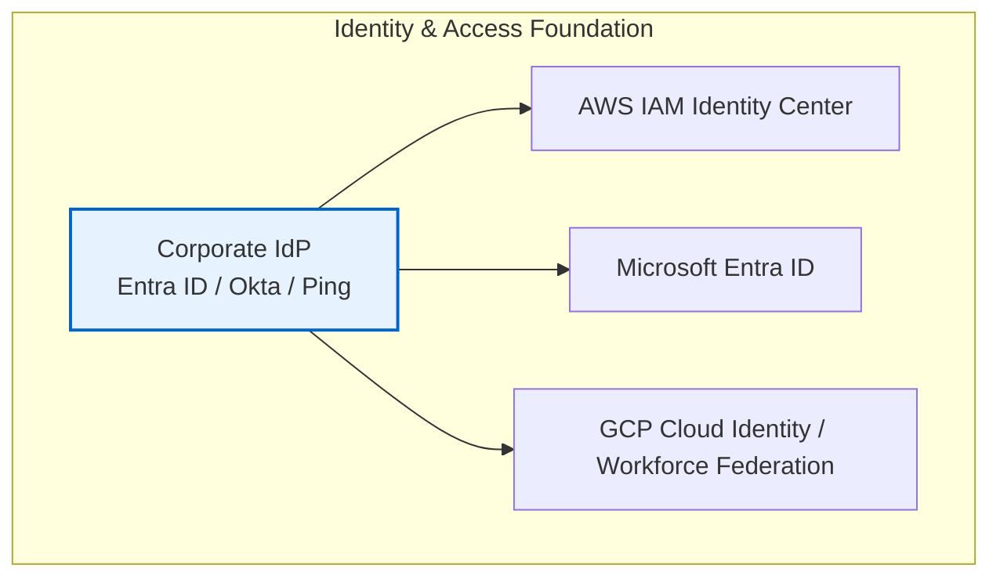
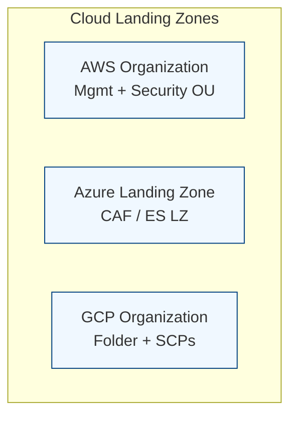
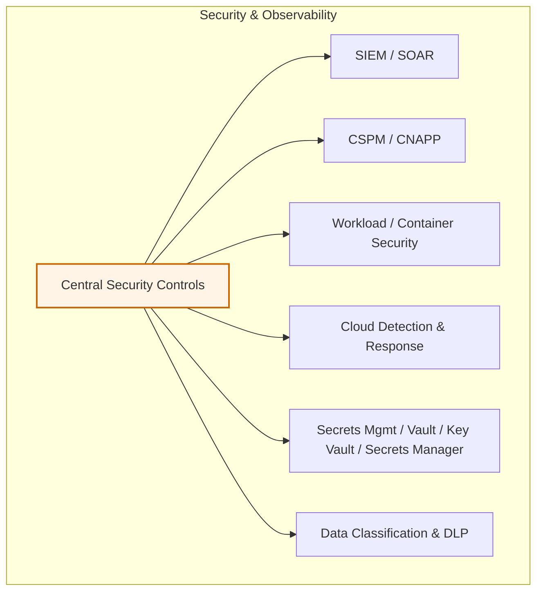
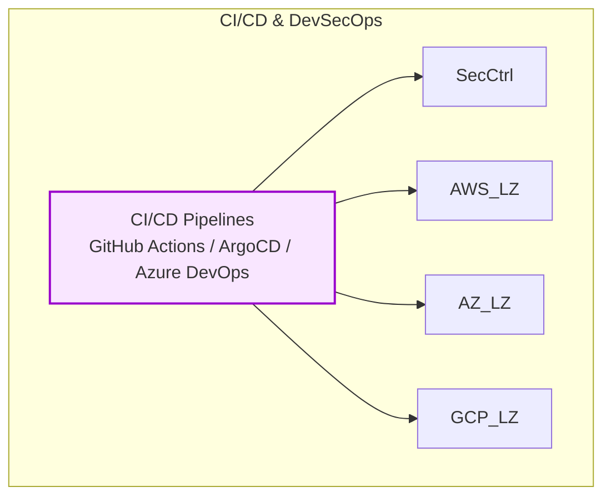
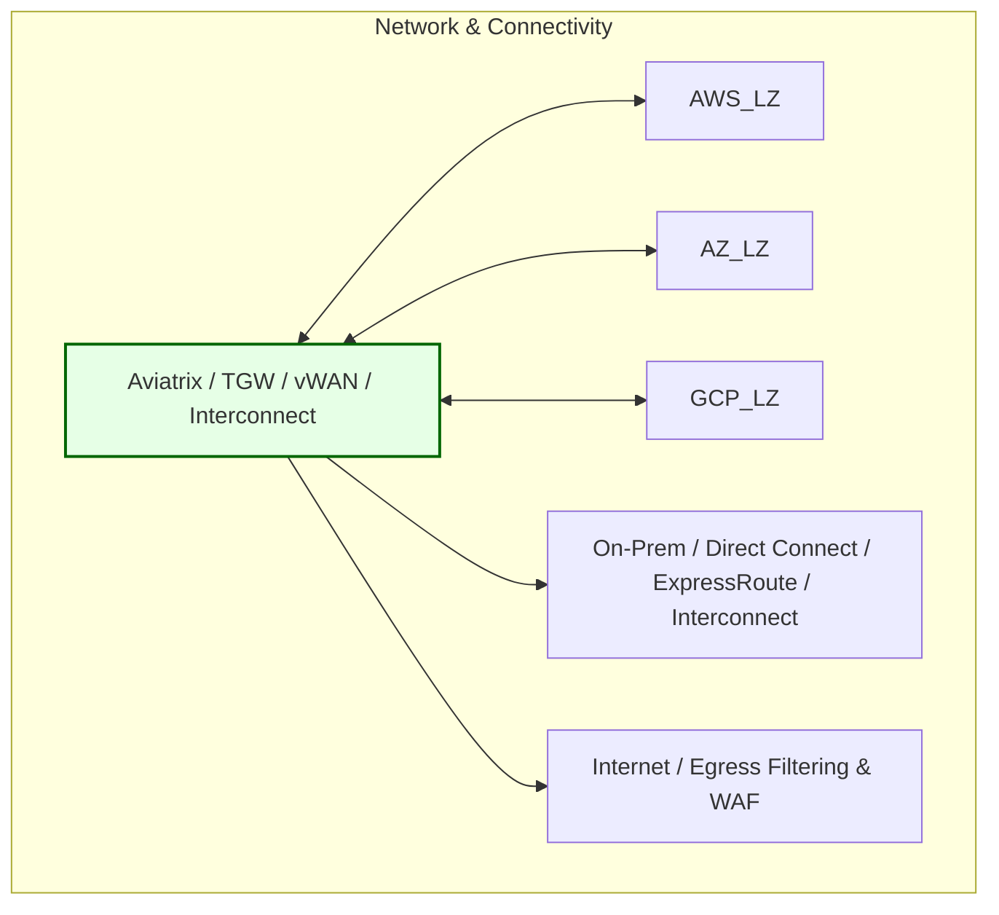
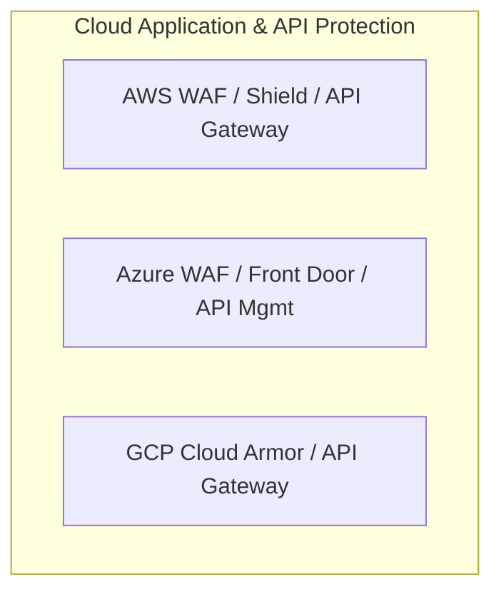
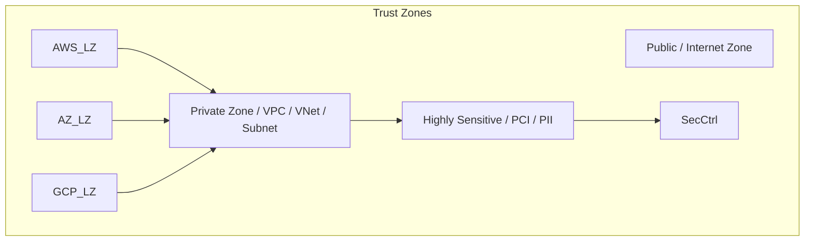
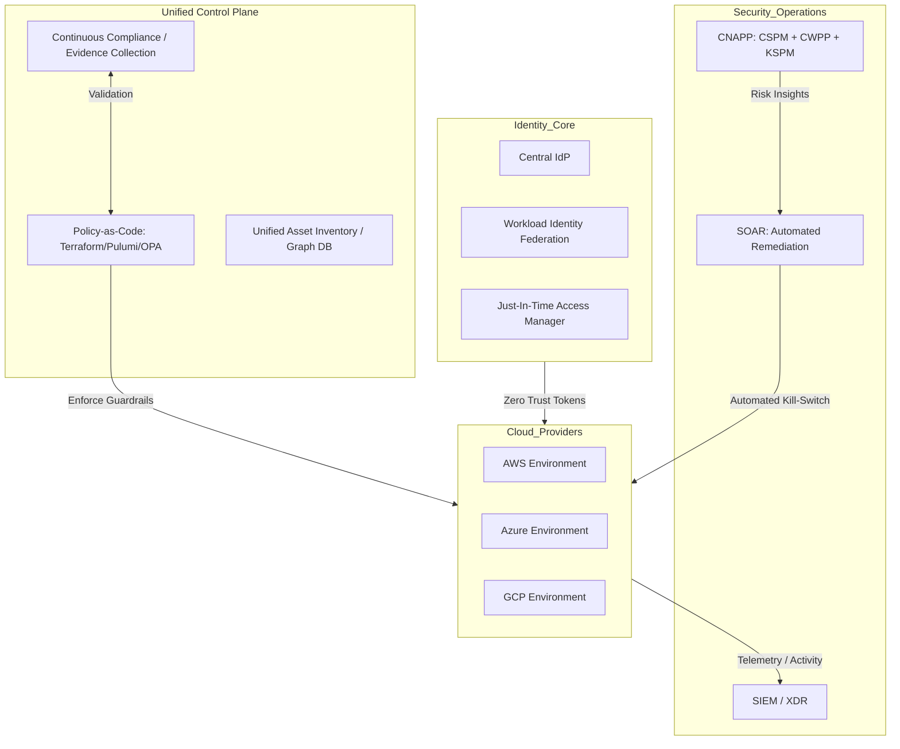

# 🌐 Dynamic Multi-Cloud Zero Trust SOC Architecture — 2026

This architecture defines a **next-generation, cognitive SOC**, designed to handle **multi-cloud complexity, cross-cloud threats, automated policy enforcement, and risk visualization**.

---

## 1️⃣ Identity & Access Foundation

* **Centralized IdP** federates identities across AWS, Azure, and GCP.
* Supports **OIDC-based Workload Identity Federation** for ephemeral credentials.
* Eliminates reliance on **long-lived secrets** in CI/CD pipelines and serverless workloads.

---

## 2️⃣ Cloud Landing Zones & Governance

* Each cloud implements **guardrails and compliance policies**.
* Landing zones integrate with **central security controls** for telemetry and risk monitoring.

---

## 3️⃣ Security & Observability Services

* **Unified telemetry** enables correlation across clouds.
* **Cognitive analysis** identifies high-risk identity and workload behaviors.
* Centralized **secrets management** supports short-lived token issuance.

---

## 4️⃣ CI/CD & DevSecOps

* Pipelines enforce **ephemeral identity tokens**.
* **Integrated guardrails** prevent non-compliant deployments automatically.

---

## 5️⃣ Network & Connectivity

* **Central transit layer** supports multi-cloud connectivity.
* Provides **policy-driven egress filtering** and secure internet access.

---

## 6️⃣ Cloud Application & API Protection

* Perimeter protection for workloads and APIs.
* Integrated with **central threat detection and CNAPP insights**.

---

## 7️⃣ Trust Zones & Data Flow

* **Private zones** host production workloads.
* **Sensitive zones** enforce DLP, continuous monitoring, and high-risk alerting.

---

## 8️⃣ Unified Control Plane & Cognitive SOC

* Cross-cloud **policy engine** prevents drift.
* **Graph-based CNAPP** detects multi-cloud threats.
* **SOAR** triggers **automated remediation** and kill-switches.

---

## 9️⃣ Key 2026 Enhancements

| Enhancement                         | Benefit                                                           |
| ----------------------------------- | ----------------------------------------------------------------- |
| Workload Identity Federation (OIDC) | Eliminates long-lived keys                                        |
| Graph-Based CNAPP                   | Correlates vulnerabilities, sensitive data, and misconfigurations |
| Automated SOAR Kill-Switch          | Rapid multi-cloud threat response                                 |
| Cross-Cloud Policy Engine           | Prevents policy drift                                             |
| Sensitive Data Amplification        | Visualizes PCI/PII/PHI exposure                                   |

---

## 🔟 Interactive SOC Simulation (React + D3 + Mermaid)

* **Click any node** → triggers a simulated SOC incident.
* **Risk propagates across clouds** with realistic depth.
* **Sensitive data & guardrails** amplify risk.
* **High-risk nodes** and **recent incidents** update live.
* **Mermaid nodes pulse** to indicate active threats visually.

---

## 1️⃣1️⃣ Strategic Simulation Use Case: Cross-Cloud Identity Pivot

* Attacker compromises a GitHub PAT → injects malicious Lambda in AWS → leverages OIDC trust to Azure → exfiltrates SQL data.
* SOC correlates **AWS + Azure telemetry** for detection.
* SOAR disables **affected identities**, rotates secrets, and preserves audit trails.

---

## 1️⃣2️⃣ Multi-Cloud Capability Matrix

| Capability       | AWS                 | Azure          | GCP                     | Unified Tech         |
| ---------------- | ------------------- | -------------- | ----------------------- | -------------------- |
| Network Security | Network Firewall    | Azure Firewall | Cloud Armor             | Aviatrix / Illumio   |
| Identity         | IAM Identity Center | Entra ID       | Cloud Identity          | Workforce Federation |
| Threat Detection | GuardDuty           | Defender       | Security Command Center | Unified CNAPP        |
| Secrets          | Secrets Manager     | Key Vault      | Secret Manager          | HashiCorp Vault      |

---

### ✅ Summary

This architecture provides a **real-time, interactive, multi-cloud Zero Trust SOC**, combining:

* **Identity federation and ephemeral access**
* **Centralized policy and telemetry**
* **Dynamic risk visualization**
* **Automated multi-cloud response via SOAR**
* **Integration-ready dashboards for React + D3 + Mermaid**

