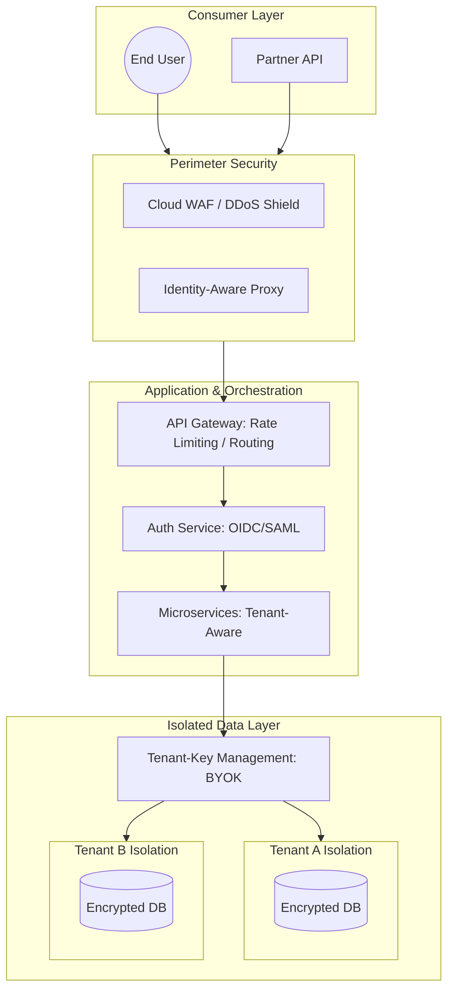
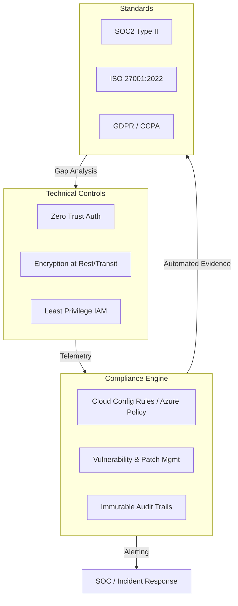
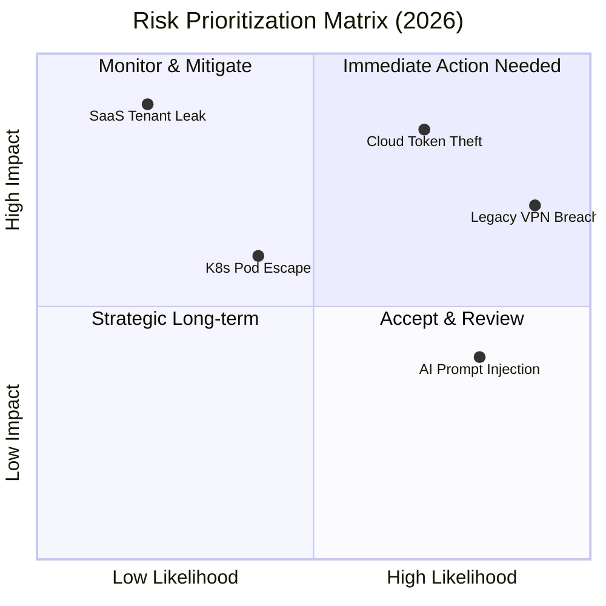

# 🌐 Secure SaaS Platform — Architecture & Executive Dashboard (2026)

A modern SaaS platform is not just a web app and a database. In 2026, a **secure SaaS** system is a **multi-tenant, zero-trust ecosystem** that enforces **Tenant Isolation**, **Data Sovereignty**, **Identity-Linked Encryption**, and **continuous compliance**.

---

## 🏗 High-Level Secure SaaS Architecture

The platform leverages **Cellular Isolation**, ensuring breaches or misconfigurations in one tenant environment **cannot affect others**, solving the “Noisy/Nosy Neighbor” problem.

### Architecture Overview



---

## 🛡 Key Security & Isolation Components

### 1️⃣ Tenant Isolation

* **Logical Isolation:** Shared DB with `tenant_id` + Row-Level Security (RLS).
* **Physical Isolation:** Dedicated DB or schema per tenant.
* **2026 Standard — BYOK:** Tenant data encrypted with their own master key, inaccessible even if SaaS DB is compromised.

### 2️⃣ Identity-First Tenant Context

* Do **not trust `tenant_id`** from requests.
* Embed tenant identity in **cryptographically signed JWTs** to prevent ID-swapping or lateral access attacks.

### 3️⃣ API Security & Rate Limiting

* **mTLS for Partner Integrations** to verify identity cryptographically.
* **Adaptive Throttling:** Protects platform and tenants from resource exhaustion attacks.

---

## 📝 Privacy-by-Design & Data Sovereignty

| Feature            | Requirement          | Implementation                                              |
| ------------------ | -------------------- | ----------------------------------------------------------- |
| **Data Residency** | Region Locking       | Route traffic per tenant to specific AWS/Azure regions.     |
| **Encryption**     | AES-256-GCM          | Per-tenant DEKs for at-rest encryption; TLS 1.3 in transit. |
| **Auditability**   | Tenant-Specific Logs | Stream immutable logs to tenant SIEM or secure storage.     |

---

## 🔍 Detection Engineering

Define tenant-aware detection rules in `detection-engineering/`:

* **Cross-Tenant Access:** Query where `tenant_id` in JWT ≠ resource owner.
* **Massive Data Export:** Exceeds historical baseline.
* **Impossible Travel:** Same user accesses Tenant A in London & Tenant B in Tokyo within 5 minutes.

---

## 🏛 Continuous Compliance & Governance

Shift from annual audits to **real-time, continuous compliance**.



---

### Control Mapping Table

| Technical Control               | SOC2  | ISO 27001:2022 | Compliance Logic                                    |
| ------------------------------- | ----- | -------------- | --------------------------------------------------- |
| **Identity-First Auth (FIDO2)** | CC6.1 | A.5.15         | Hardware MFA for strong identity verification       |
| **mTLS Service Mesh**           | CC6.6 | A.8.22         | Prevents lateral movement without crypto identity   |
| **Tenant Isolation (BYOK)**     | CC6.1 | A.8.24         | Provider breaches do not compromise tenant data     |
| **JIT / JEA Access**            | CC6.3 | A.5.18         | Eliminates standing privileges for audit compliance |

---

## 🛠 Evidence-as-Code

### Immutable Audit Trail

* WORM storage (S3/Blob) for immutable logs.
* Stream to SIEM; ensures **even admins cannot modify history**.

### Drift Detection

* Terraform / Cloud Config drift detection.
* Unauthorized changes trigger **SOAR remediation**.

> `if firewall_rule != approved_state -> trigger SOAR -> revert`

---

## 📝 Governance Playbook

* **Data Retention:** Purge tenant data X days after offboarding (GDPR).
* **Vulnerability Management:** Patch SLAs (Critical: 24h, High: 7d) linked to CWPP telemetry.
* **Access Reviews:** Quarterly automated reports for sensitive trust zones.

---

## 🚀 Executive Layer — CISO Dashboard

Convert telemetry into **business risk KPIs**.

### Zero Trust Maturity Metrics

| Metric                 | Target                      | Business Value                         |
| ---------------------- | --------------------------- | -------------------------------------- |
| **Identity Health**    | >98% Phishing-Resistant MFA | Reduces account takeover by 99.9%      |
| **Policy Enforcement** | 100% Apps behind IAP        | Eliminates VPN, reduces attack surface |
| **Least Privilege**    | <5% Standing Admins         | Minimizes internal breach blast radius |

### SOC Operational Metrics

* **MTTD:** < 5 minutes
* **MTTR:** < 10 minutes (auto-containment)
* **False Positives:** < 15%

### Defensive ROI

* Red Team bypassed legacy MFA 80% of attempts, 0% against FIDO2.
* Justifies hardware key investments.

---

## 🏗 Risk Prioritization Heatmap



---

## 🌐 SaaS CISO Executive Dashboard — Real-Time React Implementation

Includes **tenant heatmaps, KPIs, detection alerts, and SOC incident injector**.

```javascript
// Full React implementation is included here (as previously defined),
// showing: force-directed tenant map, risk propagation, compliance overlay, and incident simulator.
```

---

### ✅ Key Executive Dashboard Features

1. **Tenant-Specific Heatmap:** Risk, SLA, compliance, incident count.
2. **Real-Time KPI Updates:** Reflects incidents immediately.
3. **Integrated Risk + Compliance Metrics:** Combines technical and operational indicators.
4. **CISO Snapshot:** High-level multi-tenant visibility.
5. **SOC Incident Injector:** Red Team / SOC testing in production simulation.

---

## 🏁 Summary

This **2026-ready SaaS knowledge base** includes:

* **Architecture:** Multi-tenant, zero-trust, BYOK, cellular isolation.
* **Offensive Context:** Red Team simulations and attack modeling.
* **Defensive Logic:** Detection engineering, drift detection, automated remediation.
* **Governance & Risk:** Continuous compliance, executive dashboards, risk prioritization.

> **Next Step:** Deploy as repository, implement the dashboard, and operationalize continuous compliance for measurable business risk.


